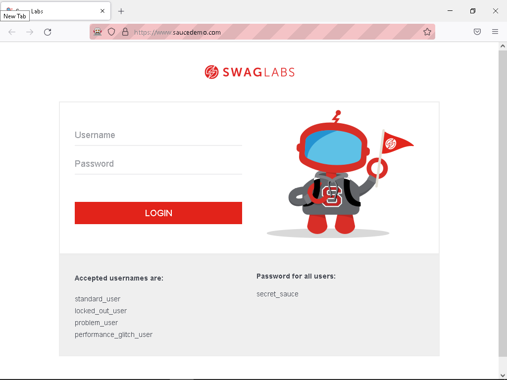
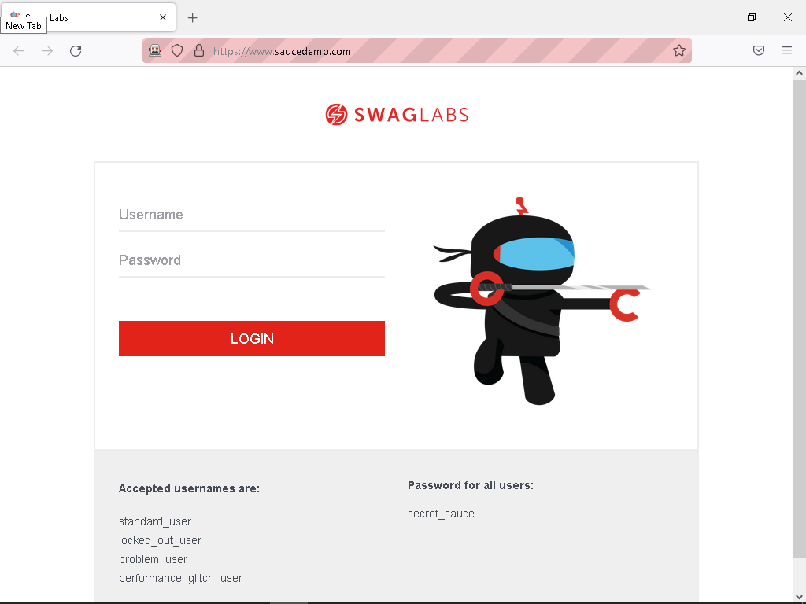

# Ninja Saucebot Firefox Add-On

Note: Firefox version is Manifest v2

### Install it

```shell
npm install --global web-ext
```

### Try it

```shell
web-ext run 
```

### Build it

```shell
web-ext build
```

### Distribute it

* Obtain API Key from [Add-on Developer Hub](https://addons.mozilla.org/en-US/developers/addon/api/key/)
* Sign Extension
```shell
web-ext sign --api-key=$FF_ADDON_ISSUER --api-secret=$FF_ADDON_SECRET
```

### Use It

Navigate to "https://www.saucedemo.com"

#### Without the Extension



#### With the Extension:


